-   [Données](#données)
-   [Cadrage](#cadrage)
    -   [Pyramides des âges](#pyramides-des-âges)
    -   [Taux par âge](#taux-par-âge)
-   [Evolution des stocks](#evolution-des-stocks)
    -   [Décès cumulés](#décès-cumulés)
    -   [Réanimation et
        hospitalisation](#réanimation-et-hospitalisation)
    -   [Réanimation par région](#réanimation-par-région)
    -   [Réanimation par département](#réanimation-par-département)
    -   [Décès cumulés par âge](#décès-cumulés-par-âge)
    -   [Réanimation par âge](#réanimation-par-âge)
    -   [Hospitalisations par âge](#hospitalisations-par-âge)
-   [Evolutions des flux](#evolutions-des-flux)
    -   [Nouveaux cas (réa/hospi/dc/rad)](#nouveaux-cas-réahospidcrad)
    -   [Excédent de sorties de
        l’hôpital](#excédent-de-sorties-de-lhôpital)
    -   [Décès par région](#décès-par-région)
    -   [Décès par département](#décès-par-département)
    -   [Réanimation par département](#réanimation-par-département-1)
    -   [Décès par âge](#décès-par-âge)

Données
=======

Données hospitalières (donc hors Ehpad, etc.)

Source :
<a href="https://www.data.gouv.fr/fr/datasets/donnees-hospitalieres-relatives-a-lepidemie-de-covid-19/" class="uri">https://www.data.gouv.fr/fr/datasets/donnees-hospitalieres-relatives-a-lepidemie-de-covid-19/</a>

Cadrage
=======

Pyramides des âges
------------------

Au 6 avril 2020 (pic)

Taux par âge
------------

Taux pour 100 000 personnes

Les taux d’hospitalisation et de réanimation sont calculés à partir du
nombre de personnes concernées le 8 avril 2020 (pic), le taux de
mortalité à partir des décès cumulés au dernier jour d’observation.

| âge     |  taux hospitalisation|  taux réanimation|  taux mortalité|
|:--------|---------------------:|-----------------:|---------------:|
| 0-9     |                  1.02|              0.34|            0.03|
| 10-19   |                  1.00|              0.26|            0.04|
| 20-29   |                  4.74|              0.80|            0.23|
| 30-39   |                 11.02|              2.82|            0.82|
| 40-49   |                 23.10|              6.76|            2.33|
| 50-59   |                 47.42|             17.20|            8.15|
| 60-69   |                 77.54|             29.00|           23.39|
| 70-79   |                120.54|             33.25|           63.74|
| 80-89   |                201.75|              8.88|          186.41|
| 90 et + |                298.65|              1.86|          371.53|

Evolution des stocks
====================

Décès cumulés
-------------

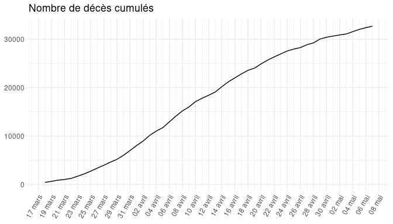

Réanimation et hospitalisation
------------------------------

Réanimation par région
----------------------

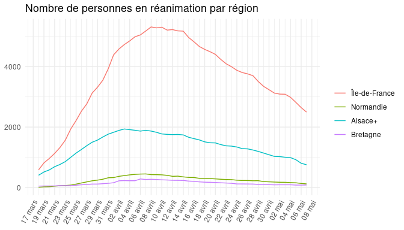

Réanimation par département
---------------------------

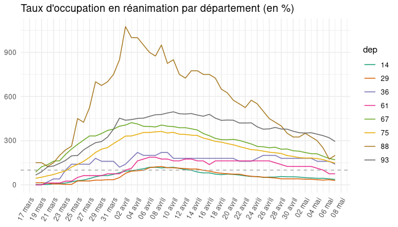

NB : à partir du nombre de lits en réanimation en 2018 (Source: DREES)

Décès cumulés par âge
---------------------

Réanimation par âge
-------------------

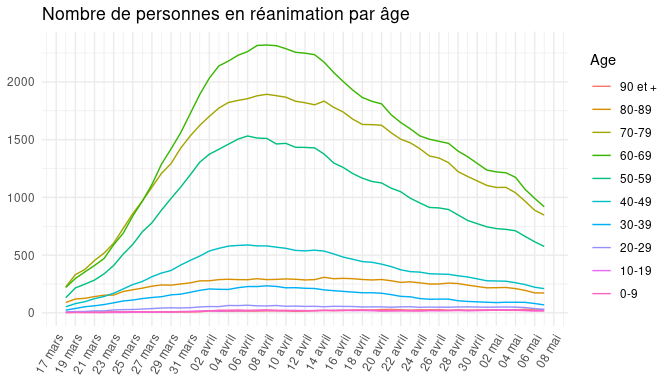

Hospitalisations par âge
------------------------

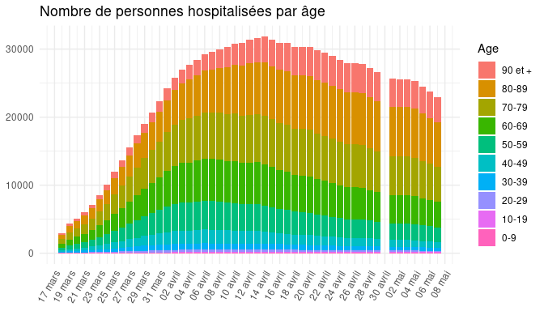

Evolutions des flux
===================

Nouveaux cas (réa/hospi/dc/rad)
-------------------------------

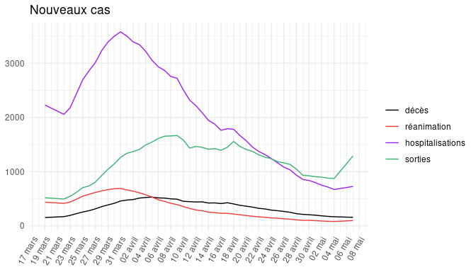

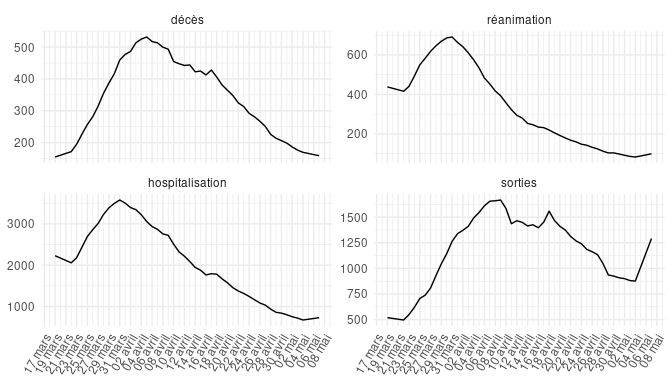

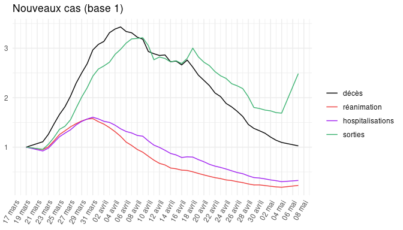

Excédent de sorties de l’hôpital
--------------------------------

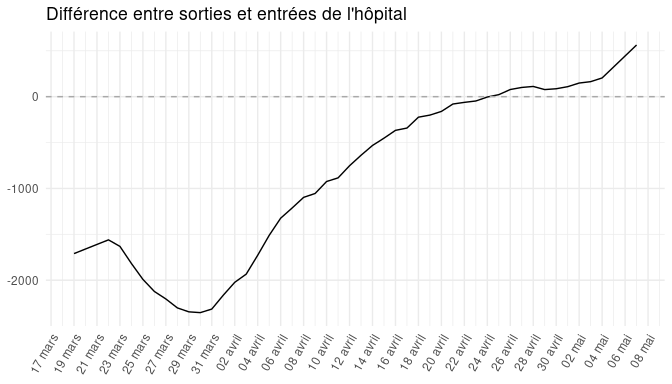

Décès par région
----------------

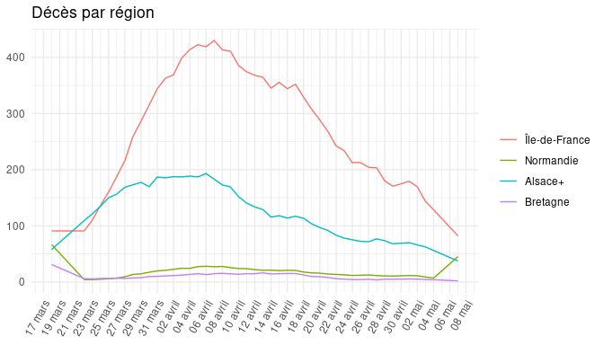

Décès par département
---------------------

Réanimation par département
---------------------------

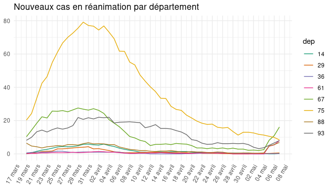

Décès par âge
-------------

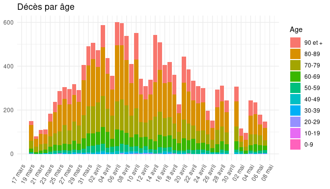
